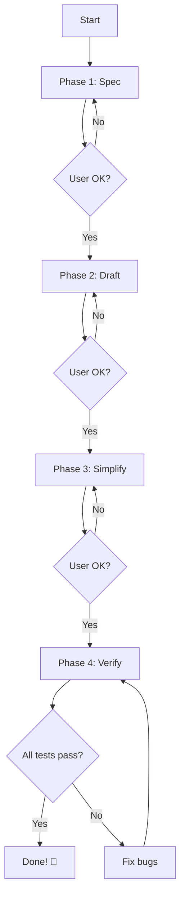

# Workflow: Pipeline (Полный цикл) 🔄

## Для кого
Для **zero-coder**, кто хочет автоматически пройти все этапы от идеи до готового кода.

## Что это
Автоматически запускает **все 4 фазы разработки** по порядку:
1. **Spec** - детальная спецификация
2. **Draft** - быстрый прототип  
3. **Simplify** - улучшение кода
4. **Verify** - проверка тестами

Вы только отвечаете на вопросы и подтверждаете этапы.

## Когда использовать

✅ **Используйте:**
- Когда начинаете новую фичу "с нуля"
- Когда хотите сделать всё "по науке"
- Когда есть время на полный цикл
- Когда важно качество

❌ **Не используйте:**
- Для маленьких изменений (1-2 строки)
- Когда нужен только прототип (используйте `/draft`)
- Когда спешите (пропустите simplify и verify)

## Как использовать

### Вариант 1: Новая фича (рекомендуется)
```
/pipeline Добавить систему комментариев
```

### Вариант 2: Из существующей идеи
```
/pipeline @specs/comments-system.md
```

## Инструкция для AI

При запуске `/pipeline`:

### 🎯 Общая структура



**Важно:** После КАЖДОЙ фазы - пауза для подтверждения пользователя!

---

### 📋 Фаза 1: Specification (Спецификация)

**Цель:** Детально описать ЧТО делаем

1. **Запусти `/spec` workflow**
   - Если есть файл → используй его
   - Если нет → создай новый в `specs/`

2. **Проведи интервью**
   - Основная механика
   - UI/UX
   - Техническая реализация
   - Граничные случаи

3. **Создай спецификацию** в `specs/[feature-name].md`

4. **Покажи результат пользователю:**
```markdown
# ✅ Фаза 1/4: Specification завершена

Создана спецификация:
- specs/comments-system.md (87 строк)

Что описано:
- 3 основных компонента
- 5 пользовательских сценариев
- 8 edge cases
- 4 API endpoints

📖 Просмотрите спецификацию.
Всё правильно? (да/изменить/отменить)
```

5. **Дождись ответа:**
   - "да" → переход к Phase 2
   - "изменить [что]" → скорректируй и покажи снова
   - "отменить" → stop pipeline

---

### 🚀 Фаза 2: Draft (Прототип)

**Цель:** Создать работающий код быстро

1. **Запусти `/draft` workflow**
   - Используй спецификацию из Phase 1

2. **Создай прототип:**
   - Минимальный рабочий код
   - БЕЗ оптимизаций
   - С TODO комментариями

3. **Покажи результат:**
```markdown
# ✅ Фаза 2/4: Draft завершена

Создан прототип:
- src/components/CommentsList.jsx
- src/components/CommentForm.jsx
- src/api/comments.js
- src/hooks/useComments.js

📊 Статистика:
- 234 строки кода
- 12 TODO для улучшений
- Основная функциональность работает

🔍 Проверьте: npm run dev
Всё работает? (да/исправить/назад/отменить)
```

4. **Дождись ответа:**
   - "да" → переход к Phase 3
   - "исправить [что]" → исправь и покажи
   - "назад" → вернись к Phase 1
   - "отменить" → stop pipeline

---

### 🧹 Фаза 3: Simplify (Улучшение)

**Цель:** Сделать код чистым и понятным

1. **Запусти `/simplify` workflow**
   - Анализируй файлы из Phase 2

2. **Создай план улучшений:**
```markdown
# План упрощения

Найдено:
- 3 места дублирования кода
- 2 длинные функции (>40 строк)
- 5 magic numbers
- Отсутствуют комментарии в 2 сложных местах
```

3. **Покажи план и дождись "да"**

4. **Примени улучшения**

5. **Покажи результат:**
```markdown
# ✅ Фаза 3/4: Simplify завершена

Улучшения:
- Убрано 45 строк дублирования
- Создано 6 переиспользуемых функций
- Добавлены константы вместо magic numbers
- Добавлены комментарии для сложных мест

📊 Метрики:
- Было: 234 строки
- Стало: 189 строк (-19%)
- Читаемость: ⭐⭐⭐⭐⭐

Продолжить к тестированию? (да/ещё упростить/назад/отменить)
```

6. **Дождись ответа:**
   - "да" → переход к Phase 4
   - "ещё упростить" → дополнительный раунд
   - "назад" → вернись к Phase 2
   - "отменить" → stop pipeline

---

### 🔬 Фаза 4: Verify (Проверка)

**Цель:** Убедиться что всё работает правильно

1. **Запусти `/verify` workflow**
   - Создай тесты по спецификации из Phase 1
   - Протестируй код из Phase 2-3

2. **Создай тесты**
   - Unit tests для функций
   - Component tests для UI
   - Integration tests для API

3. **Запусти тесты**

4. **Покажи результаты:**

#### Случай А: Все тесты прошли ✅
```markdown
# ✅ Фаза 4/4: Verify завершена

Тестирование:
✅ 15 unit tests passed
✅ 8 component tests passed  
✅ 4 integration tests passed
✅ Coverage: 94%

Проверены все сценарии из спецификации!

# 🎉 Pipeline завершён успешно!

Что создано:
1. specs/comments-system.md - Спецификация
2. src/components/* - Компоненты (189 строк)
3. src/api/comments.js - API интеграция
4. tests/* - 27 тестов

Следующие шаги:
1. Попробуйте: npm run dev
2. Запустите тесты: npm test
3. Готово к коммиту! 🚀

Хотите создать changelog entry? (да/нет)
```

#### Случай Б: Есть ошибки ❌
```markdown
# ⚠️ Фаза 4/4: Verify - найдены проблемы

Тестирование:
✅ 22 tests passed
❌ 5 tests failed

Найденные баги:
1. CommentForm отправляет пустые комментарии
2. Удаление не работает для автора
3. Loading state не показывается

Хотите, чтобы я исправил баги? (да/показать детали/отменить)
```

5. **Если есть баги → исправь → перезапусти тесты**

6. **Финальный отчёт:**
```markdown
# 🎉 Pipeline завершён!

Полный отчёт:
- artifacts/pipeline-report.md

Время: 25 минут
Фазы: 4/4 ✅
Тесты: 27/27 ✅
Качество: ⭐⭐⭐⭐⭐

Готово к продакшену!
```

---

### 📊 Создание финального отчёта

После успешного завершения создай `artifacts/pipeline-report.md`:

```markdown
# 🔄 Pipeline Report: [Feature Name]

## Общая информация
- **Дата:** 2026-01-12
- **Время выполнения:** 25 минут
- **Статус:** ✅ Завершён успешно

## Фазы

### 1️⃣ Specification
- **Время:** 8 минут
- **Итераций:** 1
- **Результат:** specs/comments-system.md (87 строк)

### 2️⃣ Draft
- **Время:** 6 минут
- **Файлов создано:** 4
- **Строк кода:** 234
- **Результат:** Работающий прототип ✅

### 3️⃣ Simplify
- **Время:** 5 минут
- **Улучшений:** 4 типа
- **Сэкономлено строк:** 45 (-19%)
- **Результат:** Чистый код ✅

### 4️⃣ Verify
- **Время:** 6 минут
- **Тестов создано:** 27
- **Покрытие:** 94%
- **Багов найдено:** 3 (исправлены)
- **Результат:** Все тесты прошли ✅

## Итоговые метрики
- **Файлов создано:** 8
- **Строк кода:** 189 (production) + 145 (tests)
- **Покрытие тестами:** 94%
- **Качество кода:** A+ (0 warnings)

## Созданные файлы

### Спецификация
- `specs/comments-system.md`

### Код
- `src/components/CommentsList.jsx`
- `src/components/CommentForm.jsx`
- `src/components/Comment.jsx`
- `src/api/comments.js`
- `src/hooks/useComments.js`

### Тесты
- `tests/CommentsList.test.jsx`
- `tests/CommentForm.test.jsx`
- `tests/api/comments.test.js`

### Документация
- `artifacts/spec-interview.md`
- `artifacts/draft-report.md`
- `artifacts/simplify-report.md`
- `artifacts/verify-report.md`
- `artifacts/pipeline-report.md` ← этот файл

## Соответствие спецификации

| Требование | Статус |
|------------|--------|
| Отображение списка комментариев | ✅ Реализовано |
| Добавление комментария | ✅ Реализовано |
| Редактирование комментария | ✅ Реализовано |
| Удаление комментария | ✅ Реализовано |
| Валидация данных | ✅ Реализовано |
| Обработка ошибок | ✅ Реализовано |
| Loading states | ✅ Реализовано |
| Адаптивная вёрстка | ✅ Реализовано |

## Следующие шаги
1. ✅ Код готов к коммиту
2. ✅ Тесты проходят
3. ⏭️ Создать pull request
4. ⏭️ Code review
5. ⏭️ Deploy to staging

---

**Pipeline completed successfully!** 🎉
```

---

## Примеры использования

### Пример 1: Полный цикл новой фичи
```
👤 Пользователь: /pipeline Добавить систему рейтингов (звёздочки)

🤖 AI:
Запускаю Pipeline для "система рейтингов"...

📋 Фаза 1/4: Specification
Начинаю интервью для детализации...

Q1: Сколько звёздочек максимум? (обычно 5)
👤: 5

Q2: Можно менять рейтинг после отправки?
👤: Да

...

✅ Спецификация готова (specs/rating-system.md)
Продолжить к Draft? (да/изменить/отменить)

👤: да

🚀 Фаза 2/4: Draft
Создаю прототип...
✅ Готово! 4 файла, работает.

Проверьте: npm run dev
Продолжить к Simplify? (да/исправить/назад/отменить)

👤: да

🧹 Фаза 3/4: Simplify
Анализирую код...
Найдено 3 улучшения. Применить? (да/показать план)

👤: да

✅ Код улучшен!
Продолжить к Verify? (да/ещё упростить/назад/отменить)

👤: да

🔬 Фаза 4/4: Verify
Создаю тесты... ✅
Запускаю тесты... ✅ 18/18 passed

🎉 Pipeline завершён за 22 минуты!
Всё готово к коммиту.
```

### Пример 2: С изменениями в процессе
```
👤 Пользователь: /pipeline @specs/notification-bell.md

🤖 AI:
📋 Фаза 1/4: Specification
Читаю specs/notification-bell.md...
Всё понятно, продолжить к Draft? (да/изменить/отменить)

👤: изменить добавить звук при новом уведомлении

🤖: ✅ Добавлено в спецификацию.
Продолжить к Draft? (да/изменить/отменить)

👤: да

🚀 Фаза 2/4: Draft
...
✅ Прототип готов с звуковыми уведомлениями
Продолжить? (да/исправить/назад/отменить)

👤: исправить звук слишком громкий

🤖: ✅ Исправлено (снижена громкость до 0.3)
Продолжить к Simplify? (да/исправить/назад/отменить)

👤: да

[продолжение pipeline...]
```

## Экстренные команды

Во время Pipeline вы можете:

- **"стоп"** - остановить pipeline
- **"назад"** - вернуться к предыдущей фазе
- **"пропусти"** - пропустить текущую фазу (не рекомендуется)
- **"начать заново"** - restart с фазы 1
- **"покажи что создано"** - список всех файлов

## Типичные ошибки

### ❌ Ошибка 1: Pipeline застрял
**Решение:** Напишите "стоп" и опишите где застряло

### ❌ Ошибка 2: Слишком долго
**Если > 30 минут:**
→ Скорее всего фича слишком большая
→ Разбейте на части и запустите pipeline для каждой

### ❌ Ошибка 3: Много итераций в одной фазе
**Если просите изменить 5+ раз:**
→ Скажите "начать заново" и будьте детальнее в Phase 1

---

## Философия Pipeline

> "Медленная работа = быстрый результат"

Pipeline кажется долгим, но:
- ✅ Меньше переделок (всё продумано в spec)
- ✅ Меньше багов (проверено тестами)
- ✅ Лучше код (прошёл simplify)
- ✅ Больше уверенности (всё задокументировано)

**Итого:** Экономия времени в долгосрочной перспективе!

**Zero-coder friendly:**
Pipeline ведёт вас за руку через весь процесс.
Вы просто отвечаете на вопросы и подтверждаете этапы.

---

**Команда запуска:** `/pipeline [описание]` или `/pipeline @specs/file.md`

**Среднее время:** 20-30 минут (зависит от размера фичи)
