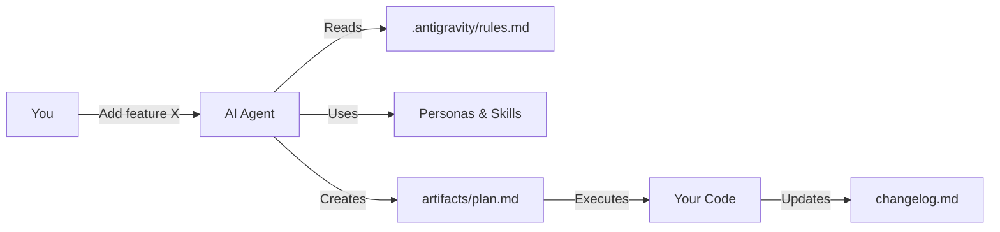
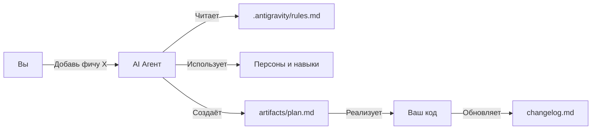

# 🛸 Antigravity Zero Template

> **AI-первый шаблон для быстрого старта проектов**  
> *v1.0 | Zero-coder friendly*

[](https://opensource.org/licenses/MIT)
[](http://makeapullrequest.com)
[](https://github.com/kisslex2013-alt/antigravity-zero-template)

[English](#-english) | [Русский](#-русский)

---

## 🇬🇧 English

### 🎯 What Problem Does This Solve?

Starting a new project with AI assistants (Gemini, Claude, Copilot) often means:
- ❌ AI doesn't understand your project structure
- ❌ Repetitive explanations every session
- ❌ Inconsistent code style and approaches
- ❌ No memory between conversations

**Antigravity Zero Template** solves this by providing a pre-configured "AI brain" that:
- ✅ Gives AI persistent context about your project
- ✅ Enforces consistent rules and patterns
- ✅ Enables specialized AI personas for different tasks
- ✅ Provides ready-to-use workflows

### 🔄 How It Works



### 📊 Template vs No Template

| Aspect | Without Template | With Antigravity |
|--------|-----------------|------------------|
| **Setup time** | 30+ min | 2 min |
| **AI context** | Lost each session | Persistent |
| **Code style** | Inconsistent | Enforced rules |
| **Security** | Hope for the best | Built-in checks |
| **Documentation** | Often forgotten | Auto-generated |

### ✨ Features

| Feature | Description |
|---------|-------------|
| 🤖 **AI Brain** | `.antigravity/` — rules, 15 personas, skills |
| 🔧 **Workflows** | `/spec` (interview), `/brainstorm` (ideation) |
| 📄 **Artifacts** | Ready templates for tasks, plans, walkthroughs |
| 📜 **Automation** | `setup.ps1`, `verify.ps1` scripts |
| 🔌 **MCP Ready** | Smart Coding MCP integration guide |
| 🎯 **Zero-coder** | Simple language, structured responses |

### 🎭 AI Personas

Switch AI "personality" for different tasks:

```
🕵️ Debugger    → Thorough bug hunting, requires logs
🏗️ Architect   → Scalable system design
👨‍🏫 Mentor      → Explains everything simply
🎨 UI/UX       → Focus on interface beauty
🛡️ Security    → Finds vulnerabilities
📝 Documenter  → Writes clear docs
⚡ Optimizer   → Performance tuning
🧪 Tester      → Test-first approach
...and 7 more!
```

### 🚀 Quick Start

```bash
# 1. Use this template (click button above)
# 2. Clone your new repo
git clone https://github.com/YOUR_USERNAME/YOUR_REPO.git

# 3. Initialize
cd YOUR_REPO
.\scripts\setup.ps1

# 4. Start coding with AI!
```

### 📁 Project Structure

```
├── .agent/workflows/    # AI workflows (/spec, /brainstorm)
├── .antigravity/        # 🧠 AI brain
│   ├── rules.md         # Core rules & security
│   ├── personas.md      # 15 AI personas
│   ├── skills/          # Extended capabilities
│   └── docs/            # AI documentation
├── artifacts/           # Session artifacts
│   ├── task.md          # Current tasks
│   ├── plan.md          # Implementation plan
│   └── walkthrough.md   # Work report
├── scripts/             # Automation
├── src/                 # Your code here!
└── GUIDE.md             # Full usage guide
```

### 📖 Documentation

- **[GUIDE.md](GUIDE.md)** — Complete usage guide (zero-coder friendly)
- **[ARCHITECTURE.md](ARCHITECTURE.md)** — System architecture
- **[docs/mcp-setup.md](docs/mcp-setup.md)** — MCP server setup

---

## 🇷🇺 Русский

### 🎯 Какую проблему решает?

При работе с AI-ассистентами (Gemini, Claude, Copilot) часто возникают проблемы:
- ❌ AI не понимает структуру вашего проекта
- ❌ Приходится объяснять одно и то же каждую сессию
- ❌ Непоследовательный стиль кода
- ❌ Нет памяти между разговорами

**Antigravity Zero Template** решает это, предоставляя "мозг AI":
- ✅ AI получает постоянный контекст о проекте
- ✅ Единые правила и паттерны
- ✅ Специализированные персоны для разных задач
- ✅ Готовые workflows

### 🔄 Как это работает



### 📊 С шаблоном vs Без

| Аспект | Без шаблона | С Antigravity |
|--------|-------------|---------------|
| **Время настройки** | 30+ мин | 2 мин |
| **Контекст AI** | Теряется | Сохраняется |
| **Стиль кода** | Разный | Единые правила |
| **Безопасность** | Как повезёт | Встроенные проверки |
| **Документация** | Забывается | Авто-генерация |

### ✨ Возможности

| Фича | Описание |
|------|----------|
| 🤖 **AI Brain** | `.antigravity/` — правила, 15 персон, навыки |
| 🔧 **Workflows** | `/spec` (интервью), `/brainstorm` (мозговой штурм) |
| 📄 **Артефакты** | Шаблоны для задач, планов, отчётов |
| 📜 **Автоматизация** | `setup.ps1`, `verify.ps1` скрипты |
| 🔌 **MCP Ready** | Инструкция по Smart Coding MCP |
| 🎯 **Zero-coder** | Простой язык, структурные ответы |

### 🎭 AI Персоны

Переключайте "характер" AI для разных задач:

```
🕵️ Debugger    → Дотошный поиск ошибок
🏗️ Architect   → Масштабируемые системы  
👨‍🏫 Mentor      → Объяснения простым языком
🎨 UI/UX       → Фокус на интерфейсе
🛡️ Security    → Поиск уязвимостей
📝 Documenter  → Понятная документация
⚡ Optimizer   → Оптимизация производительности
🧪 Tester      → Test-first подход
...и ещё 7 ролей!
```

### 🔧 Workflows

```bash
/spec @file.md     # Превратить идею в детальную спецификацию
/brainstorm        # Сгенерировать 3 варианта решения
```

**Пример `/spec`:**
```
# БЫЛО:
Хочу систему уведомлений

# СТАЛО (после интервью с AI):
## Система уведомлений
### UI/UX
- Позиция: правый верхний угол
- Анимация: slide + fade
- Автозакрытие: 5 сек
### Типы: success, error, warning, info
### API: notify(type, message, options)
...и ещё 50 строк детальной спецификации
```

### 🚀 Быстрый старт

```bash
# 1. Нажмите "Use this template"
# 2. Клонируйте
git clone https://github.com/YOUR_USERNAME/YOUR_REPO.git

# 3. Инициализация
cd YOUR_REPO
.\scripts\setup.ps1

# 4. Работайте с AI!
```

---

## 🤝 Contributing

PRs are welcome! Please read the contribution guidelines first.

## 📝 License

MIT © 2026

---

<p align="center">
  <b>Made with 🛸 by Antigravity Zero</b><br>
  <i>Escape the gravity of boilerplate</i>
</p>
